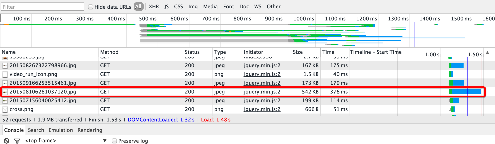
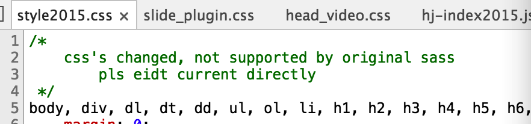
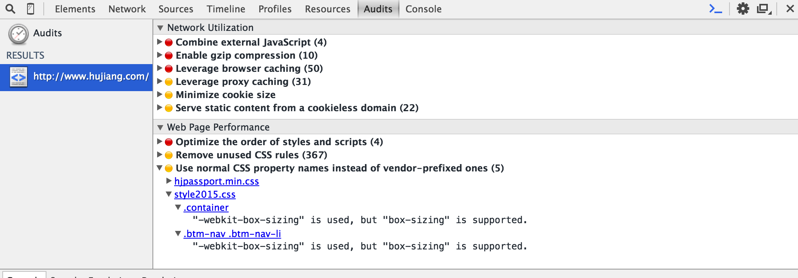

###第一题答案###
阅读了[沪江首页](http://www.hujiang.com/)的网页相关代码，总结如下：
######优点######
*	自适应做的非常好，pc和移动端页面展现都很完美
* 	js延迟和异步加载，部分需要在页面加载之后执行的通过放在页面底部延迟加载，部分可以异步的则通过async异步加载。
*   页面的配色，首屏大图滚播的渐进渐出很不错。


######缺点######
*	首次加载的时候有一张图片特别大，成为了load的瓶颈。

通过压缩，可以显著减少首屏轮播图片中这一张图片的大小

并且画质没有太大的变化，压缩前(555KB)如下：

压缩后(112KB)：


*	css codestyle有点瑕疵，没有使用预处理器
在head_video.css和slide_plugin.css中存在许多不符合codestyle的地方。如下：
 	
 	```CSS
background: #000000; // 可以简写就应该简写#000
top:0;               // 冒号后面应该有空格
```
与之相比style2005.css 中的codestyle的很规范。
在style2015.css头部注释着：

不理解edit directly是否意味着没使用less或sass而直接修改了css。另外两个css文件很明显也没有使用css预处理器，我认为对于css而言，预处理器不仅使得css编写更加模块化，也方便之后修改新增，便于阅读。
*	性能优化不足

用chrome的开发者工具看下可以发现有很多值得优化的点。Web Page Performance可能不怎么需要修改，但是网路的话无论js合并，gzip还是部分静态资源cache都是性能优化的大头。